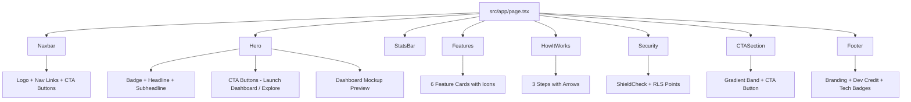

# Plan: Premium Landing Page for MasterAnalytics Pro

## Objective

Replace the current developer-facing "build progress" checklist at [`src/app/page.tsx`](src/app/page.tsx:1) with a beautiful, marketing-grade landing page that showcases the product, uses persuasive copywriting, and drives users to the dashboard via a clear CTA.

## Design Direction

- **Theme**: Keep the existing light palette (slate/white/blue) for consistency with the dashboard, login, and upload pages.
- **Accents**: Blue-to-cyan gradients (`from-blue-600 to-cyan-500`) — already used across the app for branding.
- **Style**: Premium, clean, spacious. Glassmorphism-lite cards (`bg-white/70 backdrop-blur`), subtle shadows, rounded-2xl borders.
- **Components**: Reuse existing UI primitives — [`Button`](src/components/ui/button.tsx:1), [`Card`](src/components/ui/card.tsx:1), [`Badge`](src/components/ui/badge.tsx:1) — plus `lucide-react` icons already in the project.
- **Responsive**: Mobile-first, breakpoints at `sm`, `md`, `lg`.
- **No new dependencies** required.

## Auth / Routing Strategy

- The landing page (`/`) stays **public** (not in `PROTECTED_PREFIXES` in [`src/lib/supabase/middleware.ts`](src/lib/supabase/middleware.ts:19)).
- Primary CTA links to **`/login`** — middleware automatically redirects authenticated users to `/dashboard`, so the button works for both logged-in and logged-out visitors.
- Secondary CTA links to **`/signup`** for new users.
- No server-side auth check needed on the landing page itself — keeps it fully static and cacheable.

## Page Structure (Top to Bottom)

### 1. Sticky Navbar

- Left: Logo (Activity icon in gradient square + "MasterAnalytics **Pro**" wordmark)
- Right (desktop): Anchor links — Features, How It Works, Security — + "Sign In" (ghost) and "Launch Dashboard" (primary) buttons
- Mobile: Hamburger-free simplified layout — just logo + primary CTA button

### 2. Hero Section

- **Badge**: "Polio SIA Campaign Analytics" pill with pulsing dot
- **Headline**: Large, bold — e.g., "Turn Campaign Data into Actionable Intelligence"
- **Subheadline**: 1–2 sentences describing the value prop (upload Excel reports, visualize coverage, get AI insights, export PDFs)
- **CTAs**: "Launch Dashboard" (primary, → `/login`) + "Explore Features" (outline, scrolls to #features)
- **Visual**: A stylized dashboard preview mockup built with CSS/divs (KPI cards + mini bar chart) — no real screenshot needed, keeps it self-contained
- **Background**: Gradient `from-slate-50 via-white to-blue-50` with subtle decorative blurred blobs

### 3. Stats / Trust Bar

- 4 stat tiles in a row:
  - "4-Day" — Campaign Cycle Tracking
  - "UC-Level" — Granular Coverage Data
  - "AI-Powered" — Groq LLaMA-3.3 Insights
  - "PDF" — Professional Report Export
- Each tile: large number/keyword + small label

### 4. Features Grid (#features)

- Section heading: "Everything you need to track campaign performance"
- 6 feature cards in a responsive grid (1 col mobile, 2 col tablet, 3 col desktop):
  1. **Excel Upload & Auto-Parsing** — Upload .xlsx daily & catch-up reports; headers auto-normalized and mapped
  2. **Interactive KPI Dashboard** — Real-time KPI cards with day/tehsil/UC filters
  3. **Day-by-Day Progress Charts** — Recharts visualizations tracking coverage across Days 1–4
  4. **UC-wise Coverage Comparison** — Side-by-side UC performance breakdown
  5. **AI-Powered Insights** — Groq LLaMA-3.3 analyzes your data and surfaces trends, risks, and recommendations
  6. **Professional PDF Reports** — 7-section analysis with charts, ready to share with stakeholders
- Each card: icon (lucide), title, description, subtle hover lift

### 5. How It Works (#how-it-works)

- 3-step horizontal flow with connecting arrows:
  1. **Upload** — Drag & drop your .xlsx campaign report
  2. **Analyze** — Dashboard auto-populates with KPIs, charts, and AI insights
  3. **Export** — Generate a professional PDF report in one click
- Each step: numbered circle, icon, title, short description

### 6. Security Section (#security)

- Highlight card with ShieldCheck icon
- Copy: "Bank-grade security with Supabase Row-Level Security (RLS). Your campaign data is isolated — only you can see your uploads."
- 3 mini-points: Supabase Auth, RLS data isolation, Server-side validation

### 7. Final CTA Section

- Full-width gradient band (blue-to-cyan)
- Headline: "Ready to transform your campaign data?"
- Button: "Launch Dashboard" (→ `/login`)

### 8. Footer

- Brand name + tagline
- "Developed by M. Nadeem Akhtar" with Facebook link
- Tech stack badges (Next.js, Supabase, Recharts, Groq)

## Copywriting Guidelines

- **Tone**: Professional, confident, data-driven — speaking to public health analysts and campaign managers
- **Focus**: Outcomes (actionable intelligence, identify underperforming areas, data-driven decisions) not just features
- **Keywords**: polio campaign, SIA, coverage, UC, analytics, AI insights, PDF reports
- **No jargon dumps** — keep descriptions concise and benefit-oriented

## Technical Implementation

### Files to Create

| File                                      | Type                       | Purpose                                    |
| ----------------------------------------- | -------------------------- | ------------------------------------------ |
| `src/app/page.tsx`                        | Server Component (rewrite) | Main landing page — composes all sections  |
| `src/components/landing/navbar.tsx`       | Server Component           | Sticky top navigation                      |
| `src/components/landing/hero.tsx`         | Server Component           | Hero section with headline + CTAs + mockup |
| `src/components/landing/stats-bar.tsx`    | Server Component           | 4 stat tiles                               |
| `src/components/landing/features.tsx`     | Server Component           | 6-card feature grid                        |
| `src/components/landing/how-it-works.tsx` | Server Component           | 3-step flow                                |
| `src/components/landing/security.tsx`     | Server Component           | Security/RLS highlight                     |
| `src/components/landing/cta-section.tsx`  | Server Component           | Final CTA band                             |
| `src/components/landing/footer.tsx`       | Server Component           | Footer with credits                        |

### Files to Modify

| File                 | Change                                                                                  |
| -------------------- | --------------------------------------------------------------------------------------- |
| `src/app/layout.tsx` | Update metadata description to be marketing-focused (optional, current is already good) |

### Files NOT Touched

- Dashboard, login, upload pages — unchanged
- `package.json` — no new dependencies
- `tailwind.config.ts` — no new config needed
- `globals.css` — no changes needed

## Component Architecture



## Reusable Patterns from Existing Code

- **Header pattern**: Mirror [`src/app/dashboard/page.tsx`](src/app/dashboard/page.tsx:95) header (logo + gradient square + UserMenu area) — but simplified for public page
- **Card pattern**: Use existing [`Card`](src/components/ui/card.tsx:1) / `CardContent` / `CardHeader` / `CardTitle` / `CardDescription`
- **Button pattern**: Use existing [`Button`](src/components/ui/button.tsx:1) with `asChild` + `next/link`
- **Gradient text**: `bg-gradient-to-r from-blue-600 to-cyan-500 bg-clip-text text-transparent` — used in dashboard and login
- **Icon usage**: `lucide-react` icons (Activity, UploadCloud, BarChart3, FileText, Sparkles, ShieldCheck, etc.)

## Landing Page Flow

```mermaid
flowchart LR
    L[Landing Page - Public] -->|Click Launch Dashboard| LG[/login]
    LG -->|Authenticated| DASH[/dashboard]
    LG -->|Not Authenticated| FORM[Login Form]
    FORM -->|Success| DASH
    L -->|Click Sign Up| SU[/signup]
    SU -->|Success| DASH
```

## Cleanup Tasks (Deferred — User Wants to Check Functionality First)

These were identified during codebase examination but the user paused deletion to verify app functionality first. They remain pending:

- Remove unused UI components: `tabs.tsx`, `separator.tsx`, `skeleton.tsx` (0 app imports)
- Remove unused deps: `@radix-ui/react-dialog`, `@radix-ui/react-tooltip`, `@radix-ui/react-tabs`, `@radix-ui/react-separator`, `@fontsource/inter`
- Remove empty `src/hooks/` directory
- Fix `og-image.png` missing reference in [`src/app/layout.tsx`](src/app/layout.tsx:9)

## Acceptance Criteria

1. Landing page renders at `/` with all 8 sections
2. "Launch Dashboard" button navigates to `/login` (redirects to `/dashboard` if authenticated)
3. "Sign Up" button navigates to `/signup`
4. Page is fully responsive (mobile, tablet, desktop)
5. No new npm dependencies added
6. No changes to existing dashboard, login, or upload functionality
7. Page builds successfully on Vercel (no TypeScript errors)
8. Copywriting is professional and benefit-oriented
9. Visual style is consistent with existing app (slate/white/blue palette)
